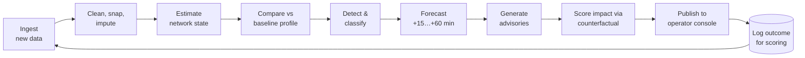
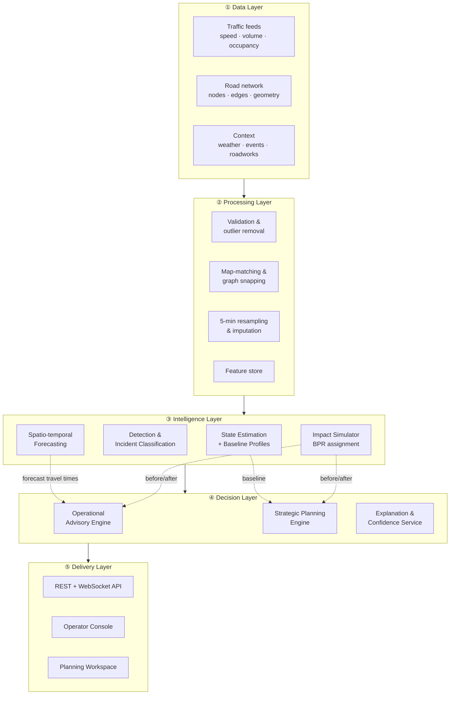

# PRAVAAH

**P**redictive **R**oad-network **A**nalytics, **V**isualization, **A**dvisory & **A**ssessment **H**ub

An AI decision-support system for urban road networks. PRAVAAH ingests traffic and road-network data, infers what is happening on the network right now, forecasts what is likely to happen 15–60 minutes ahead, recommends immediate diversions and traffic-management responses, and identifies where longer-term infrastructure changes would reduce recurring congestion — every output carrying its evidence, its confidence, and its expected impact.

> Software-only. All advisories, diversion plans and infrastructure proposals are **simulated and advisory**. The system performs no live signal control, no camera access, no GPS-device integration, no roadside sensor integration and no municipal infrastructure access.

*(Rename the project freely — the architecture and approach below are what matter.)*

---

## Table of Contents

1. [Problem Statement](#1-problem-statement)
2. [Problem Understanding](#2-problem-understanding)
3. [Operating Workflow](#3-operating-workflow)
4. [System Architecture](#4-system-architecture)
5. [Our Approach](#5-our-approach)
6. [Evaluation Methodology](#6-evaluation-methodology)
7. [Explainability & Confidence Handling](#7-explainability--confidence-handling)
8. [Scope, Assumptions & Limitations](#8-scope-assumptions--limitations)
9. [Repository Structure](#9-repository-structure)
10. [Getting Started](#10-getting-started)
11. [Reproducibility & Engineering Discipline](#11-reproducibility--engineering-discipline)
12. [Development Roadmap](#12-development-roadmap)
13. [Future Enhancements](#13-future-enhancements)

---

## 1. Problem Statement

Large, rapidly changing urban road networks are difficult to manage. Traffic conditions can shift within minutes — an incident, a cloudburst, a stadium emptying — while other congestion is stubbornly permanent, caused by geometric or capacity limitations that reappear at the same place at the same hour every weekday.

A traffic manager therefore faces two fundamentally different questions at once, and conventional tools answer neither well:

- **"What do I do in the next twenty minutes?"** — requires detecting abnormality fast, predicting how it will spread, and issuing a diversion that does not simply relocate the jam.
- **"What should we change permanently?"** — requires separating one-off incidents from recurring structural failure, diagnosing the physical cause, and quantifying the benefit of a fix before anyone pours concrete.

PRAVAAH is built for a **Hyderabad-like operating environment**: dense mixed traffic, strong peak-hour commuter flows, signalized junctions, flyover and service-road pairs, arterial corridors, localized recurring bottlenecks, road works, weather-related slowdowns, event-driven surges, incidents, and congestion spillback across neighbouring segments.

**What this is not.** It is not a navigation application — it optimizes network outcomes, not one driver's route. It is not a chatbot — natural language is a presentation layer over computed quantities, never a substitute for them.

---

## 2. Problem Understanding

### 2.1 The central distinction: recurrent vs. non-recurrent congestion

Most of the system's design follows from one observation: **slow is not the same as abnormal.**

A corridor crawling at 12 km/h at 6:15 PM on a Tuesday may be behaving exactly as it always does. The same 12 km/h at 2:00 PM on a Sunday is an event demanding response. A system that thresholds on absolute speed will drown its operator in alerts during every peak hour and stay silent during genuine anomalies.

| | **Recurrent congestion** | **Non-recurrent congestion** |
|---|---|---|
| Cause | Demand persistently exceeds geometric capacity | Incident, roadworks, weather, event surge |
| Signature | Predictable, repeats by time-of-day and day-type | Sudden onset, deviates from historical profile |
| Correct response | Infrastructure or signal-plan redesign | Real-time diversion and traffic management |
| Module | Strategic Planning Engine | Operational Advisory Engine |

Every detection in PRAVAAH is measured against a **learned historical baseline** for that specific segment, time-of-day and day-type — not against a global threshold. This single decision is what allows the same pipeline to feed both the operational and the strategic halves of the system.

### 2.2 Traffic is a network, not a list of segments

Congestion propagates. When a downstream link saturates, queues extend **backwards** across the upstream junction, blocking movements that have nothing to do with the original problem — spillback. Treating each segment as an independent time series discards exactly the information needed to anticipate this.

Consequences for the design:

- The network is modelled as a **directed graph**, and forecasting uses **spatio-temporal** models that read upstream and downstream neighbours, not per-segment univariate models.
- Incidents have a characteristic **asymmetric spatial signature** — a sharp speed drop upstream of a point with a simultaneous flow drop downstream — which is how we distinguish an incident from a demand surge.
- A diversion is evaluated for its effect on the **whole affected sub-network**, because rerouting traffic onto an alternative that is already near capacity converts one jam into two.

### 2.3 Mixed traffic breaks textbook assumptions

Two-wheelers, autos, cars, buses and freight sharing an unlaned carriageway produce a traffic stream that behaves differently from the homogeneous flow assumed by classical models:

- Speed distributions are **wide, skewed and multi-modal**, so the mean is a poor summary and Gaussian assumptions are unsafe. We use **median and MAD-based robust statistics** throughout detection.
- **Lane discipline is weak**, so capacity is better expressed per carriageway width than per lane, and two-wheelers continue to filter forward at densities where cars have stopped — meaning speed drops before flow does.
- Free-flow speed is **segment-specific**, learned from the data as a high percentile of observed speed, rather than read off a posted limit.
- **Flyover and service-road pairs** are coupled: they share demand and their split shifts with conditions, so they are modelled as parallel edges between the same node pair, not as unrelated links.

### 2.4 Real data is dirty

Any system evaluated on unseen conditions must assume sensors drop out, report stuck values, and disagree with their neighbours. Robustness is therefore treated as a **first-class design requirement**, not a hardening pass at the end: the models are trained with input dropout, detection requires spatial corroboration before firing, and when data coverage falls below threshold the system widens its uncertainty intervals, degrades to the profile-based fallback, and **says so on screen**.

### 2.5 What a good system must therefore do

| Requirement | Design implication |
|---|---|
| Detect congestion **and** abnormality | Congestion index *and* baseline-deviation z-score, computed separately |
| Control false alarms | Persistence, hysteresis, spatial corroboration, change-point confirmation |
| Classify incidents where data supports it | Feature-based classifier with an explicit *low-confidence* outcome |
| Forecast 15–60 min | Direct multi-horizon prediction with calibrated intervals |
| Recommend, not just report | Counterfactual impact computed before the advisory is issued |
| Separate tactics from strategy | Recurrent bottleneck mining feeds a distinct planning module |
| Be trustworthy | Evidence, confidence and stated assumptions attached to every output |

---

## 3. Operating Workflow

### 3.1 The system tick

PRAVAAH runs a continuous pipeline on a fixed **5-minute cadence**. Each tick:



1. **Ingest** — new observations arrive and are snapped to the road graph.
2. **Clean** — outliers removed, gaps imputed, data-coverage score computed per segment.
3. **Estimate** — speed, flow and a congestion index assigned to every edge; the whole network now has a state, including segments with no direct observation.
4. **Compare** — each segment scored against its learned profile for this time-of-day and day-type.
5. **Detect & classify** — anomalies confirmed through persistence and neighbour corroboration, then classified as recurring congestion, incident, roadworks, weather or event surge.
6. **Forecast** — network state predicted at +15, +30, +45 and +60 minutes with prediction intervals.
7. **Recommend** — for each confirmed problem, candidate responses generated and tested.
8. **Score** — each candidate simulated against the do-nothing counterfactual; only responses with positive expected impact are surfaced, ranked by benefit.
9. **Publish** — advisories pushed to the console with evidence and confidence.
10. **Log** — predictions are stored and later scored against what actually happened, which feeds the accuracy dashboard.

### 3.2 The operator's journey

**Monitor.** The map shows the live network coloured by congestion index. The alert queue on the left is sorted by severity and is deliberately short — routine peak-hour congestion does not generate alerts, because it is expected.

**Investigate.** Clicking an alert opens the evidence panel: observed speed against the historical band, the deviation score, which neighbouring segments corroborate the signal, current data coverage, and the classifier's probability distribution over causes.

**Anticipate.** The segment view carries one time axis running from two hours in the past to sixty minutes into the future. History and forecast are read together, with the forecast drawn as a widening fan.

**Act.** The advisory card states the recommended action, the expected vehicle-hours of delay saved, the effect on the alternative route, the spillback risk, and the assumptions the estimate rests on. The operator acknowledges, dismisses or annotates — and that feedback is logged.

**Plan.** A separate Planning workspace, operating on weeks of history rather than minutes, ranks recurring bottlenecks, diagnoses each one's physical cause, and presents candidate infrastructure interventions with modelled before/after impact.

---

## 4. System Architecture

### 4.1 Layered view



### 4.2 Component responsibilities

| Component | Responsibility |
|---|---|
| **Ingestion & Validation** | Parse organizer datasets, enforce schema, flag stuck/implausible sensors, compute per-segment coverage score |
| **Network Graph Service** | Directed graph of junctions and segments with length, lanes, capacity, free-flow speed, road class, flyover flag, signal metadata |
| **Feature Store** | Canonical 5-minute binned matrices (segment × time), temporal lags, spatial lags, calendar encodings, context flags |
| **State Estimator** | Assigns speed / flow / congestion index to *every* edge, propagating from observed to unobserved links via graph-based interpolation |
| **Baseline Profiler** | Learns median + MAD speed profile per (segment × time-of-day × day-type); the reference for all abnormality judgements |
| **Detection Engine** | Robust z-scores, EWMA/CUSUM change detection, persistence and hysteresis logic, spatial corroboration, alert lifecycle management |
| **Incident Classifier** | Gradient-boosted classifier over spatio-temporal signature features; outputs a probability distribution with a rule-based fallback |
| **Forecasting Engine** | Baseline → LightGBM → spatio-temporal GNN ladder; direct multi-horizon heads; conformal prediction intervals |
| **Impact Simulator** | BPR volume-delay functions with incremental assignment; the counterfactual engine shared by both decision modules |
| **Advisory Engine** | Candidate generation (diversions, signal timing, turn restrictions, lane reversal, DMS), feasibility filtering, impact ranking |
| **Planning Engine** | Recurrent bottleneck mining, cause diagnosis, intervention matching, before/after scenario modelling |
| **Explanation Service** | Assembles evidence bundles, SHAP attributions, confidence bands and assumption lists for every output |
| **API Gateway** | REST for queries and scenarios; WebSocket for live state, alerts and forecast pushes |
| **Frontend** | Operator Console (map, alert queue, segment detail, time scrubber) and Planning Workspace |

### 4.3 Core data model

```
Node     : node_id, lat, lon, junction_type, is_signalized, phases[]
Edge     : edge_id, from_node, to_node, length_m, lanes, road_class,
           capacity_vph, free_flow_speed_kmph, is_flyover, geometry
Observation : edge_id, ts_5min, speed_kmph, volume_vph,
              occupancy, source, quality_flag
Context  : ts_5min, rain_mm, visibility, temperature
Event    : event_id, type, edge_ids[], start_ts, end_ts, severity, source
Profile  : edge_id, dow_type, tod_bin, median_speed, mad_speed, n_samples
```

Every downstream module reads from this model, so adding a new data source means writing one adapter — not touching the intelligence layer.

### 4.4 Technology stack

| Layer | Technology |
|---|---|
| Language | Python 3.11 (backend/ML), TypeScript (frontend) |
| API | FastAPI + Uvicorn, WebSocket for live push |
| Graph & geo | NetworkX, GeoPandas, Shapely |
| Data | Pandas, Polars, Parquet feature store |
| ML | scikit-learn, LightGBM, PyTorch (+ PyTorch Geometric for the GNN) |
| Explainability | SHAP, conformal prediction (MAPIE) |
| Storage | PostgreSQL + PostGIS (entities), Parquet (time series), Redis (live state cache) |
| Orchestration | APScheduler for the 5-minute tick; Docker Compose for the stack |
| Tracking | MLflow experiment logs, per-run metrics JSON |
| Frontend | React + TypeScript, MapLibre GL + deck.gl, Recharts, Zustand |

### 4.5 Key architectural decisions

- **Graph-first.** The road network is the primary abstraction, which is what makes spillback modelling, spatial corroboration and route-based recommendations possible at all.
- **A shared impact simulator.** Operational diversions and infrastructure proposals are scored by the *same* engine, so "expected impact" means the same thing everywhere in the product.
- **Model ladder, not model gamble.** Simple baselines ship first and stay in the results table permanently; sophisticated models must earn their place by beating them.
- **Degradation is designed.** Every module declares what it does when inputs are missing, and the UI surfaces that state rather than hiding it.
- **Computation before narration.** Numbers are produced by deterministic, testable code. Language generation only describes them.

---

## 5. Our Approach

### 5.1 Network state estimation

Congestion index per segment is `CI = 1 − (observed_speed / free_flow_speed)`, bucketed into **Free / Moderate / Heavy / Jam**. Free-flow speed is learned per segment as a high percentile of observed off-peak speed rather than assumed from road class.

Unobserved segments are filled by graph-aware interpolation from topological neighbours of the same road class, weighted by inverse network distance — and flagged as inferred, at reduced confidence, so an operator never mistakes an estimate for a measurement.

### 5.2 Detection of abnormality

For each segment we compute a **robust deviation score** against the learned profile:

```
z = (speed_observed − median_profile) / (1.4826 × MAD_profile)
```

MAD is used instead of standard deviation because mixed-traffic speed distributions are heavy-tailed and skewed, where the standard deviation is dominated by outliers.

Because the rubric explicitly rewards controlling false alarms, suppression is built from four independent mechanisms:

| Mechanism | Purpose |
|---|---|
| **Persistence** | Require N consecutive bins of deviation before firing |
| **Hysteresis** | Fire at `z < −3`, clear only at `z > −1.5` — prevents alert flapping |
| **Spatial corroboration** | Raise confidence when upstream neighbours also deviate; an isolated single-segment anomaly is usually sensor failure |
| **Change-point confirmation** | EWMA / CUSUM on the residual stream detects genuine onset quickly without reacting to single-bin noise |

Alerts have a lifecycle — `candidate → confirmed → escalating → resolving → cleared` — so the operator sees one evolving situation rather than a stream of duplicate notifications.

### 5.3 Incident detection & classification

Where data supports it, confirmed anomalies are classified. The feature vector captures the **spatio-temporal signature** rather than raw speed:

- Onset sharpness (speed gradient over the first bins)
- Upstream/downstream speed differential and flow differential — the asymmetry that distinguishes a capacity-blocking incident from a demand surge
- Spatial extent and propagation direction
- Deviation from the recurrent profile for this exact time slot
- Duration so far, and rate of queue growth
- Context flags: rainfall, scheduled event, known roadworks

A gradient-boosted classifier outputs a probability distribution over `{recurring congestion, incident, roadworks, weather-induced, event surge}`. A transparent rule-based classifier runs in parallel and takes over when the model is below its confidence floor. **Low confidence is reported as low confidence** — the system is permitted to say it does not know the cause while still reporting that something is wrong.

### 5.4 Forecasting (15–60 minutes)

Built as a ladder, with every rung retained in the published results table:

| Tier | Model | Role |
|---|---|---|
| 0 | Persistence + historical profile average | Honest baselines; nothing ships without beating them |
| 1 | **LightGBM**, temporal lags + upstream/downstream spatial lags + calendar + context | Robust production workhorse |
| 2 | **Spatio-temporal GNN** (STGCN / Graph WaveNet) over the road adjacency matrix | Captures propagation and spillback explicitly |

Two deliberate choices:

- **Direct multi-horizon heads.** A separate head per horizon, rather than recursive rollout, because recursive error compounds badly by +60 minutes.
- **Calibrated uncertainty.** Quantile regression (pinball loss at q10/q50/q90) plus **conformal prediction** on a held-out calibration set, giving prediction intervals with statistically valid empirical coverage — reported, not assumed.

Accuracy is reported **per horizon and separately for congested periods**, because aggregate error is dominated by easy free-flow bins and flatters a model that is useless exactly when it matters.

### 5.5 Operational recommendations

A recommendation is a **computed object first and a sentence second.**

For a confirmed problem, the engine:

1. Identifies the affected flow on the congested corridor.
2. Generates k-shortest alternative paths on the graph using **forecast** time-dependent travel times, not current ones — diverting onto a road that is about to congest is worse than doing nothing.
3. Checks residual capacity on each alternative via its volume-to-capacity ratio.
4. Runs an **incremental assignment with BPR volume-delay functions** to estimate the post-diversion network state, which is what proves the plan does not simply relocate the jam.
5. Compares against the do-nothing counterfactual.

Routing is not the only lever a traffic manager has, so the candidate set also includes **signal green-time reallocation** (Webster's method on approach flows), **junction turn restrictions**, **tidal lane reversal**, **staggered event egress** and **DMS messaging** — each with a feasibility flag and an impact estimate.

Each advisory carries: the action, expected **vehicle-hours of delay saved**, resulting v/c on the alternative, spillback risk, confidence level, and the assumptions the estimate rests on.

Where an LLM is used, it operates strictly as a **narration and reasoning layer over computed numbers**. It explains and contextualizes an advisory; it never originates a quantity.

### 5.6 Strategic infrastructure recommendations

Operating on weeks of history rather than minutes:

**Mine.** Score every segment by `frequency × severity × duration`, filtered to **recurrent** events only, so genuine structural bottlenecks are not confused with a road that happened to have three crashes.

**Diagnose.** Match the signature to a physical cause — lane drop, oversaturated junction (`v/c > 1`), merge/weave conflict, insufficient link storage causing spillback, poor signal coordination along a corridor, or an unsignalized conflict point.

**Prescribe.** Map each cause to a catalogue of interventions: capacity addition, grade separation, dedicated slip lane, U-turn relocation, one-way pairing, corridor signal coordination (green wave), channelization, or bus-bay relocation.

**Quantify.** Modify the capacity parameter of the affected edge(s), re-run the *same* assignment under the *same* demand, and report the delta in total vehicle-hours of delay, mean corridor speed and maximum queue length — as a **range with stated assumptions**, never as a false-precision single number.

---

## 6. Evaluation Methodology

The evaluation harness is built early and runs on every commit, because accuracy claims are only worth what they can be reproduced against.

### 6.1 Metrics

| Module | Metrics |
|---|---|
| Detection | Precision, recall, F1, **false alarms per 100 segment-hours**, mean detection latency |
| Classification | Per-class precision/recall, confusion matrix, calibration (reliability curve) |
| Forecasting | MAE / RMSE / MAPE **per horizon**; congested-period error; interval coverage vs. nominal; skill score vs. persistence |
| Recommendations | Estimated delay saved, alternative-route v/c feasibility, share of advisories that are feasible and non-relocating |
| Robustness | Degradation curves under masking, noise and demand shift |

### 6.2 Robustness protocol

Explicitly designed experiments, reported as a table:

| Test | Protocol |
|---|---|
| **Missing data** | Randomly mask 10 / 20 / 40% of sensors at inference; report the degradation curve |
| **Sensor noise** | Inject Gaussian noise and spike/stuck-value faults into speed and volume |
| **Demand shift** | Scale demand ±25% and re-evaluate |
| **Unseen regimes** | Hold out entire incident days, a heavy-rain day and an event day from training |

Models are trained with **input dropout** so they learn to operate with partial observability rather than discovering it for the first time at evaluation.

### 6.3 Validation discipline

Splits are **chronological, never random** — random splits across a time series leak the future into the training set and inflate every number. Whole days are held out, evaluation is run on unseen days, and results are reported with seeded runs.

---

## 7. Explainability & Confidence Handling

Explainability is structural — attached to objects, not written as a paragraph at the end.

**Every alert card carries:** trigger reason, observed vs. baseline values, the deviation score, which neighbouring segments corroborated it, current data coverage percentage, and a confidence level.

**Every forecast carries:** a prediction fan with calibrated intervals, the historical profile drawn behind it for comparison, and SHAP-based top contributing features for the tree model.

**Every recommendation carries:** the counterfactual comparison, the computed impact, the feasibility check, and an explicit assumptions list.

**Confidence is degraded honestly.** When sensor coverage on a corridor falls, intervals widen, the system falls back to the profile-based model, and a **reduced-confidence banner appears on screen**. A system that stays quietly confident on bad data is more dangerous than one that admits the gap.

---

## 8. Scope, Assumptions & Limitations

### 8.1 Hard scope boundaries

Per the challenge rules, PRAVAAH is **software-only and advisory**. It does not control signals, access cameras, integrate GPS devices, connect to roadside sensors, touch municipal infrastructure, or initiate construction. Every diversion plan, signal-timing suggestion and infrastructure proposal is a **simulated recommendation for a human decision-maker**.

### 8.2 Assumptions

- Organizer-provided data is broadly representative of the network's behaviour over the covered period.
- Free-flow speed can be estimated from observed off-peak conditions.
- Capacity can be approximated from road class, carriageway width and observed maximum throughput.
- Demand is treated as approximately inelastic within a short advisory horizon — diverted traffic reroutes but does not disappear.
- BPR volume-delay functions, calibrated for mixed traffic, are an acceptable macroscopic approximation of link performance.

### 8.3 Known limitations

- Impact estimates come from a **macroscopic/mesoscopic** model, not microsimulation; they are directionally reliable and should be read as ranges, not guarantees.
- Incident classification depends on what the data supports; where the signature is ambiguous, the system reports an anomaly with an unknown cause rather than guessing a label.
- Segments with no observation throughout the dataset are inferred with permanently lower confidence.
- Driver compliance with advisories is a modelled parameter, not a measured one, and real-world compliance would shift realized impact.
- Forecast accuracy degrades during genuinely unprecedented events — the system widens intervals rather than pretending otherwise.

These limitations are surfaced in the product, not buried in this document.

---

## 9. Repository Structure

```
pravaah/
├── README.md
├── docker-compose.yml
├── Makefile                       # make setup / train / evaluate / run
├── configs/                       # YAML configs — no hardcoded params
│   ├── data.yaml
│   ├── detection.yaml
│   ├── forecast.yaml
│   └── simulation.yaml
├── data/
│   ├── raw/                       # organizer datasets (immutable)
│   ├── interim/
│   └── processed/                 # 5-min binned Parquet feature store
├── src/
│   ├── ingestion/                 # loaders, validators, map-matching
│   ├── network/                   # graph build, capacity, topology
│   ├── state/                     # state estimation, baseline profiler
│   ├── detection/                 # anomaly detection, incident classifier
│   ├── forecasting/               # baselines, lightgbm, gnn, conformal
│   ├── simulation/                # BPR assignment, impact engine
│   ├── advisory/                  # diversion & traffic-management engine
│   ├── planning/                  # bottleneck mining, infra scenarios
│   ├── explain/                   # SHAP, evidence bundles, confidence
│   └── api/                       # FastAPI app, WebSocket, schemas
├── frontend/                      # React + TypeScript operator console
├── notebooks/                     # exploration only — never the pipeline
├── tests/                         # unit + integration tests
├── experiments/                   # MLflow runs, metrics JSON, result tables
└── docs/
    ├── architecture.md
    ├── data_dictionary.md
    ├── evaluation_report.md
    └── demo_script.md
```

---

## 10. Getting Started

```bash
# 1. Clone and configure
git clone <repo-url> && cd pravaah
cp .env.example .env

# 2. Place organizer datasets
cp <organizer-data>/* data/raw/

# 3. Bring up the full stack
docker compose up --build

# 4. Build the graph, feature store and baseline profiles
make setup

# 5. Train the model ladder
make train

# 6. Reproduce the evaluation tables
make evaluate

# 7. Open the console
#    Operator console : http://localhost:3000
#    API docs         : http://localhost:8000/docs
```

**Replay mode** — the demo path — lets you scrub any historical day and watch detection, forecasting and advisory generation run as though live:

```bash
make replay DATE=2024-08-14 SPEED=60x
```

---

## 11. Reproducibility & Engineering Discipline

- `docker compose up` reproduces the entire stack from a clean machine.
- All randomness seeded; dependencies pinned; dataset hash recorded per run.
- The pipeline is **config-driven** — no magic numbers in code.
- Notebooks are for exploration only and are never on the execution path.
- Unit tests on ingestion, graph construction and detection logic; integration tests on the end-to-end tick.
- MLflow tracks every training run; `experiments/` holds the metrics JSON behind every number in this README.
- CI runs linting, tests and a smoke evaluation on each push.

---

## 12. Development Roadmap

| Phase | Deliverable | Checkpoint |
|---|---|---|
| **0** | Data audit, graph construction, 5-min feature store, baseline profiles, Docker skeleton, README | **CP1** |
| **1** | State estimation, detection engine, alert queue, live map, replay mode | **CP2** |
| **2** | Forecasting ladder, evaluation harness, conformal intervals | CP3 |
| **3** | Incident classifier, diversion engine, BPR impact simulator | CP3 |
| **4** | Bottleneck mining, infrastructure scenario builder, before/after reporting | CP3 |
| **5** | Robustness experiments, explainability surfaces, UI polish, demo | **CP3** |

The evaluation harness is built in Phase 1, not Phase 5 — most of the final assessment rests on accuracy and robustness claims that have to be substantiated with reproducible numbers.

---

## 13. Future Enhancements

### 13.1 Modelling

- **Physics-informed hybrid forecasting** — couple the learned model with a cell-transmission or LWR kinematic-wave model so predictions respect flow conservation and shockwave propagation, improving extrapolation into genuinely unseen regimes.
- **Graph transformers with learned adjacency** — let the model discover functional coupling between segments that are not topologically adjacent (parallel corridors, common origin-destination pairs) rather than relying solely on the road graph.
- **Transfer learning across corridors** — pre-train on data-rich corridors and fine-tune on sparsely instrumented ones, extending coverage without new sensors.
- **Probabilistic incident onset** — move from "is there an incident now?" to "what is the hazard rate of an incident on this segment in the next 30 minutes?" given weather, demand and historical crash geography.
- **Vehicle-class-aware modelling** — separate two-wheeler and four-wheeler dynamics, which behave very differently at high density in mixed traffic.

### 13.2 Decision intelligence

- **Multi-agent RL for coordinated signal plans** — learn corridor-wide green-wave policies in simulation, always exported as advisory plans for human approval.
- **Network-level optimization** — move from ranking independent advisories to solving for the best *combination* of interventions under a budget of operator attention.
- **Compliance-aware routing** — model partial driver compliance explicitly and optimize advisories for realistic, rather than perfect, uptake.
- **Multi-objective planning** — extend the infrastructure module to trade off delay reduction against cost, construction disruption, emissions and equity of access.
- **Counterfactual learning from logged decisions** — use the operator's accept/dismiss feedback to learn which advisories are actually actionable in practice.

### 13.3 Platform

- **Full SUMO microsimulation validation** of the highest-value infrastructure proposals, calibrated against the macroscopic model.
- **Digital twin mode** — a sandbox where planners can edit the network (add a lane, close a link, re-time a junction) and replay a full month of historical demand against it.
- **Emissions and exposure layer** — convert delay and stop-go cycles into estimated emissions and population exposure, so congestion relief can be argued on public-health grounds.
- **Public transit integration** — incorporate bus occupancy and headway so advisories can favour person-throughput over vehicle-throughput.
- **Streaming architecture** — migrate the 5-minute batch tick to Kafka + Flink for sub-minute latency at city scale.
- **Mobile field interface** — a lightweight view for on-ground traffic personnel, with push advisories and structured incident confirmation that feeds labels back into the classifier.
- **Federated multi-city deployment** — model registry and profile learning that adapts to a new city's data without retraining from scratch.

---

## Team

| Name | Role |
|---|---|
| _TBD_ | Data engineering & network graph |
| _TBD_ | Forecasting & evaluation |
| _TBD_ | Detection & recommendation logic |
| _TBD_ | Frontend & visualization |

## License

MIT — see [LICENSE](LICENSE).

## Acknowledgements

Built for the hackathon challenge on AI-driven urban traffic decision support. Road-network and traffic datasets provided by the organizers. All advisories and infrastructure proposals are simulated and advisory only.

